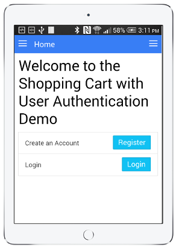

<h1>Shopping Cart with User Authorization Apps</h1>

   
    

      
      
      &nbsp;&nbsp;&nbsp;
      
    

   

  <h2>What Do These Apps Do</h2>
    <h4>
      

        This repository is a collection of four apps that demonstrate the use of a shopping cart,
        with user authorization to access a database. Three apps share a common Firebase database,
        and if you register in one app, you can use the same login in the other apps. There is
        a web version, an Android version, and an apple (iPad/iPhone) version. The other app uses MongoDB
        for the database. It is a MEAN (Mongo DB, Express, Angular JS, Node JS) stack app.
      

    </h4>
    
  <h2>What Features Do These Apps Have</h2>
    <h4>
      <ol>
        <li>Register an Account with E-Mail/Password</li>
        <li>Login using E-Mail/Password</li>
        <li>Login user social media (Facebook, Google, Twitter, Github)</li>
        <li>Change Password for your E-Mail/Password account</li>
        <li>Modify the menu system if logged in/logged out</li>
        <li>Multi-level user authentication (User, Manager, Admin) with different menus</li>
        <li>Display a Store of products to purchase</li>
        <li>Display a shopping cart of selected products</li>
        <li>Provide the ability to add/edit/delete the store products (need Manager access)</li>
      </ol>
    </h4>

  <h2>Getting The Apps</h2>
    <h4>
      

        This app is available four ways:
      

      <ol>
        <li>
          
          On the <a href="http://scottnakada.github.io/UserAuthStore/yoFireAuthStore/dist/public/index.html">web</a>
          connected to a Firebase database:  
        </li>
        <li>
          
          On the <a href="http://yomongoauthstore.herokuapp.com/index.htm">web</a>,
          connected to a Mongo DB database:  
        </li>
        <li>
          
          On Android devices through the
          <a href="http://www.amazon.com/Shopping-Authorization-using-Ionic-Firebase/dp/B015TPUMMQ/ref=sr_1_3?ie=UTF8&qid=1443836085&sr=8-3&keywords=quickstart+prototypes">
            Amazon Apps Store
          </a>.
        </li>
        <li>
          
          On Apple devices (iPhone/iPad), by downloading an app called Ionic View, and selecting the
          app id: <a href="http://scottnakada.github.io/UserAuthStore/index.html#ios">E993A8E0</a>. See the next section for directions
          to try the app.  
        </li>
      </ol>
    </h4>
